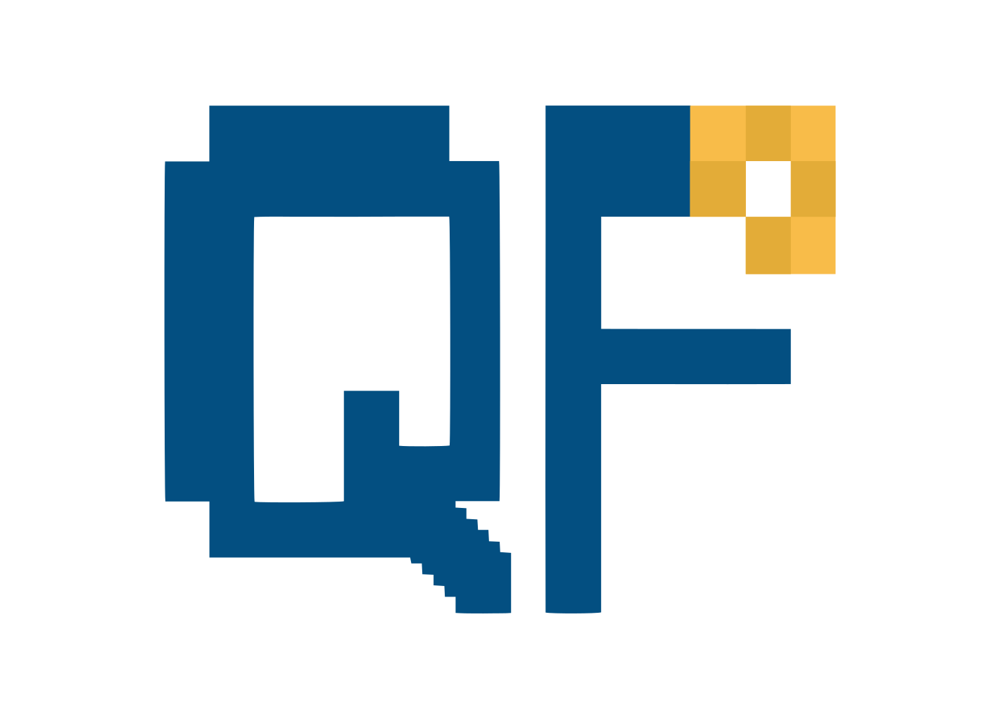
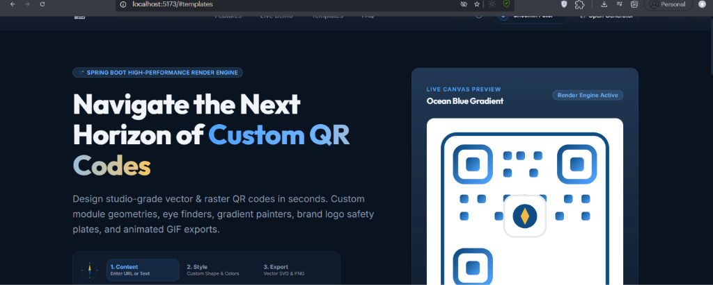
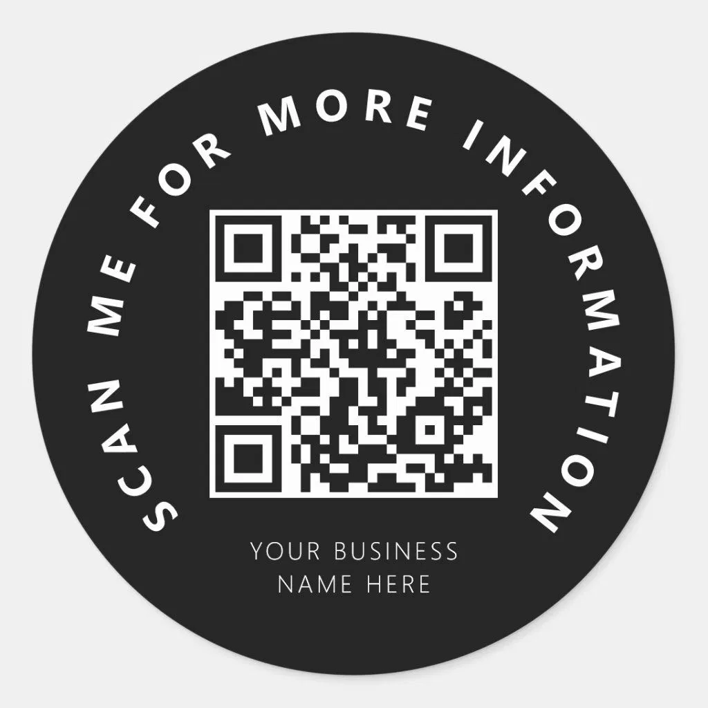
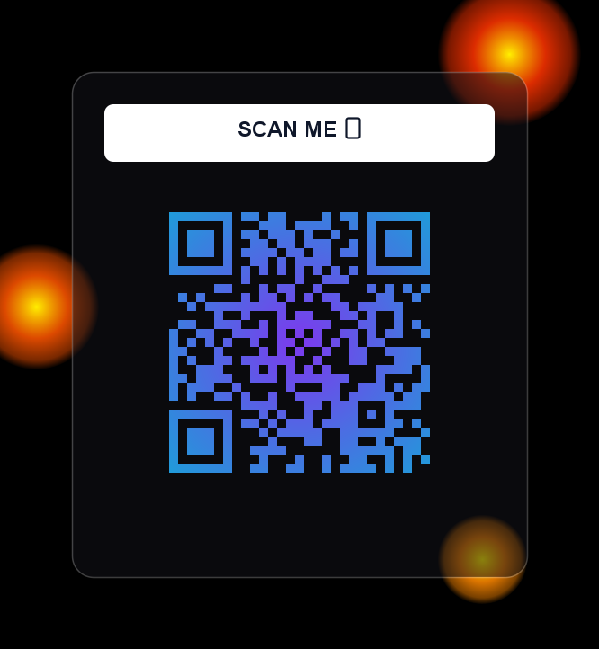
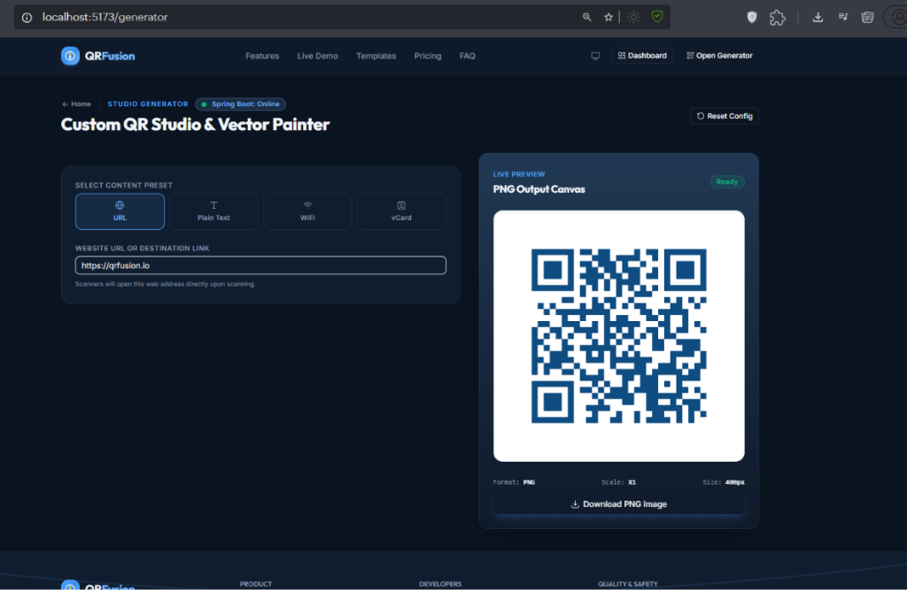
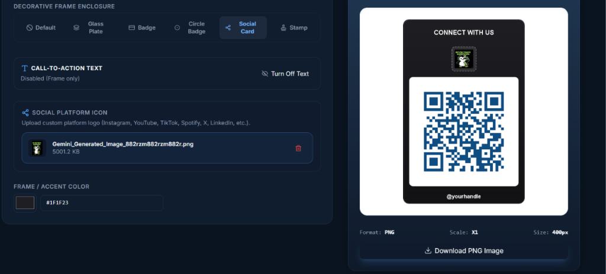
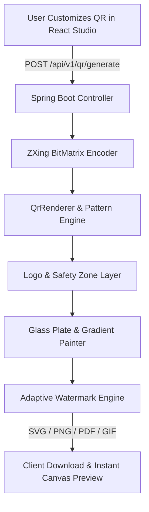

<div align="center">

  

  # 🚀 QRFusion

  **Create stunning, customizable, and production-ready QR codes with powerful vector rendering, artistic styling, logo embedding, gradients, and animated GIF exports.**

  <br />

  [](https://www.oracle.com/java/)
  [](https://spring.io/projects/spring-boot)
  [](https://react.dev/)
  [](https://www.typescriptlang.org/)
  [](https://vitejs.dev/)
  [](https://tailwindcss.com/)
  [](LICENSE)

  <br />

  [Live Demo](http://localhost:5173) • [API Documentation](#-api-reference) • [Features](#-key-features) • [Installation](#-getting-started)

</div>

---

## ✨ Preview

<div align="center">

| **Landing Page & Hero Studio** | **Interactive QR Studio Generator** |
| :---: | :---: |
|  |  |

| **Glass Plate & Glassmorphism QR** | **Animated GIF QR Export** |
| :---: | :---: |
|  |  |

| **Dashboard & Analytics** | **Logo Embedding & Safety Zone** |
| :---: | :---: |
|  |  |

| **Gradient & Pattern Painter** | **Responsive Mobile UI** |
| :---: | :---: |
|  |  |

</div>

---

## 📖 About QRFusion

**QRFusion** is an open-source, full-stack QR generation and design platform engineered for developers, designers, and businesses. Standard QR codes are often plain, black-and-white, and visually unappealing. Existing online tools either lock vector exports behind paywalls, introduce scan-breaking logos, or lack high-performance rendering.

QRFusion solves these problems by providing:
* 🎨 **Vector-Grade Customization**: Custom module geometries, rounded corners, diamond patterns, and decorative finder eyes.
* 🛡️ **Scan Reliability & Safety**: Automatic Error Correction Headroom (**Level H**, 30% recovery) and optical safety plates so embedded brand logos never break scanner readability.
* ⚡ **High-Speed Java Rendering Engine**: Custom Spring Boot graphics pipeline processing vector SVG, high-DPI PDF, raster PNG, and multi-frame animated GIF exports in under 50ms.
* 💎 **Glassmorphism & Art Fusion**: Advanced canvas blending, glass plate frames, background image sampling, and linear/radial gradient painters.

---

## ⚡ Key Features

| Feature Group | Capabilities & Highlights | Supported |
| :--- | :--- | :---: |
| **Module Geometries** | Square, Rounded, Circle, Diamond, Dot, and Halftone | ✔ |
| **Finder Eye Styles** | Classic Square, Rounded Eye, Circle Eye, Instagram Frame, Modern Border | ✔ |
| **Color Painters** | Solid Color, Linear Gradient, Radial Gradient, Custom Hex Pickers | ✔ |
| **Pattern Overlays** | Micro Dots, Crosshatch, Grid, Diagonal Stripes, Wave Overlays | ✔ |
| **Glassmorphism** | Translucent Glass Plate Frames, Reflection Glows, Blurred Underlays | ✔ |
| **Logo Embedding** | Circle / Square / Rounded Logo Plates, Transparent Borders, Custom Safety Zone | ✔ |
| **Art Fusion Masking** | Background Image Module Masking, Blending Modes, Background Sampler | ✔ |
| **Multi-Format Export** | Scalable SVG Markup, Print PDF Bytes, High-DPI PNG, Animated GIF | ✔ |
| **Watermark Engine** | Contrast-Aware Adaptive Branding Watermark (`QrFusion_logo_2.svg`) | ✔ |
| **User Dashboard** | Save QR Codes, Organize Folders, Analytics, Scan History, Favorites | ✔ |
| **Authentication** | JWT Token Bearer Security, Google OAuth 2.0 Single Sign-On | ✔ |
| **UI & Experience** | Dynamic Dark/Light Theme, Sticky Glass Navbar, Responsive Layouts | ✔ |

---

## 🛠 Tech Stack

### Frontend Architecture
* **Core Framework**: [React 19](https://react.dev/) + [TypeScript 5.7](https://www.typescriptlang.org/)
* **Build Tooling**: [Vite 6.0](https://vitejs.dev/)
* **Styling & Icons**: [TailwindCSS 4.0](https://tailwindcss.com/) + [Lucide React](https://lucide.dev/)
* **Animations**: [Framer Motion](https://www.framer.com/motion/)
* **Router**: React Router DOM 7

### Backend Architecture
* **Language & Runtime**: [Java 26 / OpenJDK 21](https://www.oracle.com/java/)
* **Framework**: [Spring Boot 3.5.16](https://spring.io/projects/spring-boot)
* **Security & Auth**: Spring Security + JJWT + Google API Client
* **QR Core**: ZXing (Zebra Crossing) 3.5.3
* **Image Processing**: Java 2D Graphics Engine (`Graphics2D`, `BufferedImage`, `ImageIO`)

### Database & Storage
* **RDBMS**: PostgreSQL 16 (Production) / H2 In-Memory (Development)
* **ORM**: Spring Data JPA + Hibernate 6.6

---

## 📂 Project Structure

```bash
QRFusion/
├── qrfusion-backend/            # Java Spring Boot 3.5 Backend API
│   ├── src/main/java/com/qrfusion/backend/
│   │   ├── config/              # CORS, Security, and App Configuration
│   │   ├── controller/          # REST API Endpoints (QR, Auth, Dashboard, Redirects)
│   │   ├── dto/                 # Request/Response Data Transfer Objects
│   │   ├── entity/              # JPA Database Entities (User, SavedQrCode, Folder, ScanEvent)
│   │   ├── repository/          # Spring Data Repositories
│   │   ├── security/            # JWT Filters, Google Token Verifiers, UserPrincipal
│   │   ├── service/             # Business Logic & QR Generator Service
│   │   └── renderer/            # Graphics & Export Rendering Pipeline
│   │       ├── animation/       # Animated Multi-Frame GIF Sequence Writer
│   │       ├── background/      # Art Fusion Module Masking & Sampler
│   │       ├── color/           # Linear & Radial Gradient Painters
│   │       ├── finder/          # Custom Finder Eye Shape Renderers
│   │       ├── frame/           # Glass Plate & Card Frame Engine
│   │       ├── logo/            # Logo Placement & Safety Zone Plate Renderers
│   │       ├── pattern/         # Pattern Overlay Painters
│   │       ├── pdf/             # Vector PDF Document Exporter
│   │       ├── svg/             # Scalable Vector Graphics (SVG) Generator
│   │       └── watermark/       # Adaptive Visibility Watermark Engine
│   └── src/main/resources/
│       └── application.properties
│
├── qrfusion-frontend/           # React 19 + TypeScript + Vite Web Application
│   ├── src/
│   │   ├── app/                 # Router & Application Providers
│   │   ├── assets/              # Logos, Illustrations, and Static SVGs
│   │   ├── components/          # Reusable UI Primitives (Button, Card, Input, Modal)
│   │   │   ├── auth/            # Protected Routes & Google Auth Buttons
│   │   │   ├── brand/           # Logo & Decorative Divider Components
│   │   │   ├── layout/          # Sticky Navbar, Footer, Navigation Tabs
│   │   │   └── studio/          # QR Generator Controls, Canvas Preview, Export Modals
│   │   ├── hooks/               # Custom React Hooks (Theme, QR State, Debounce)
│   │   ├── lib/                 # API Clients & Utility Functions
│   │   └── pages/               # Application Views
│   │       ├── auth/            # Sign In / Sign Up View
│   │       ├── contact/         # Contact Developer & Support Form
│   │       ├── dashboard/       # Saved QR Codes Grid, Analytics & Folders
│   │       ├── generator/       # Main Studio Generator Page
│   │       ├── landing/         # Marketing Landing Page & Sections
│   │       └── settings/        # User Account & Profile Settings
│   ├── package.json
│   └── vite.config.ts
└── README.md
```

---

## ⚙️ How It Works



1. **User Customizes QR**: The user selects colors, module geometries, finder styles, logos, and frame presets in the React studio.
2. **REST API Transmission**: The frontend transmits the JSON / Multipart payload to Spring Boot (`POST /api/v1/qr/generate`).
3. **ZXing Encoding**: The backend encodes content into a 2D `BitMatrix` at Error Correction Level H (30% recovery headroom).
4. **Graphics Rendering Pipeline**:
   - Data modules are rendered with chosen geometries (Square, Circle, Diamond, Rounded).
   - Linear or Radial gradient painters apply smooth color transitions.
   - Finder eyes are painted with custom inner/outer frame geometries.
5. **Logo & Safety Plate**: Embedded logo is scaled, clipped (Circle/Rounded), and backed with an optical safety plate.
6. **Watermark & Export**: Adaptive watermark (`QrFusion_logo_2.svg`) is applied with contrast checking, outputting SVG, PNG, PDF, or animated GIF.

---

## 🚀 Getting Started

### Prerequisites
* **Java**: JDK 21 or Java 26
* **Node.js**: v18.0 or higher
* **Maven**: Included via `mvnw` wrapper

### 1. Clone the Repository
```bash
git clone https://github.com/bhoominpatel/QRFusion.git
cd QRFusion
```

### 2. Backend Setup (Spring Boot)
```bash
cd qrfusion-backend

# Build the project
./mvnw clean compile

# Run the Spring Boot application (starts on http://localhost:8080)
./mvnw spring-boot:run
```

### 3. Frontend Setup (React + Vite)
```bash
cd ../qrfusion-frontend

# Install dependencies
npm install

# Start the Vite development server (starts on http://localhost:5173)
npm run dev
```

### 4. Environment Variables
Create a `.env` file in `qrfusion-frontend/`:
```env
VITE_API_BASE_URL=http://localhost:8080
VITE_GOOGLE_CLIENT_ID=your-google-client-id.apps.googleusercontent.com
```

---

## 📡 API Reference

### 1. Generate QR Code
`POST /api/v1/qr/generate` (Supports `multipart/form-data` or `application/json`)

#### Parameters
| Field | Type | Description |
| :--- | :--- | :--- |
| `content` | String | URL or text payload to encode (e.g. `https://qrfusion.io`) |
| `style` | String | `SQUARE`, `ROUNDED`, `CIRCLE`, `DIAMOND` |
| `finderStyle` | String | `CLASSIC`, `ROUNDED`, `CIRCLE`, `INSTAGRAM`, `MODERN_FRAME` |
| `colorMode` | String | `SOLID`, `LINEAR_GRADIENT`, `RADIAL_GRADIENT` |
| `foregroundColor` | String | Hex color string (e.g. `#4A9AFA`) |
| `backgroundColor` | String | Hex color string (e.g. `#0A1420`) |
| `format` | String | `PNG`, `SVG`, `PDF`, `GIF` |
| `logo` | File | Optional logo image upload |

#### Sample Request (cURL)
```bash
curl -X POST http://localhost:8080/api/v1/qr/generate \
  -F "content=https://qrfusion.io" \
  -F "style=ROUNDED" \
  -F "foregroundColor=#4A9AFA" \
  -F "backgroundColor=#0A1420" \
  -F "format=PNG"
```

### 2. Authentication API

| Endpoint | Method | Description |
| :--- | :--- | :--- |
| `/api/v1/auth/signup` | `POST` | Register new account (`name`, `email`, `password`) |
| `/api/v1/auth/login` | `POST` | Authenticate user & return JWT Token |
| `/api/v1/auth/google` | `POST` | Google Single Sign-On token exchange |
| `/api/v1/auth/me` | `GET` | Fetch authenticated user profile details |

---

## 🗺 Roadmap

- [x] High-performance Spring Boot render engine
- [x] Vector SVG, PDF, and PNG export engines
- [x] Glassmorphism & Glass Plate frame presets
- [x] Animated GIF QR code generation
- [x] Logo embedding with optical safety zone
- [x] JWT & Google OAuth single sign-on
- [x] Adaptive contrast-aware watermarking (`QrFusion_logo_2.svg`)
- [x] Contact developer form & interactive landing page
- [ ] AI-assisted prompt styling & pattern generation
- [ ] Dynamic QR short-link analytics dashboard with geolocation
- [ ] Batch QR generation via CSV/JSON upload

---

## 💙 Why I Built QRFusion

> *"As a 4th-year Computer Science & Engineering student, I built **QRFusion** to push the boundaries of custom Java 2D graphics rendering, Spring Boot architecture, and modern React user experiences. 
> 
> Standard QR code generators are often rigid, ugly, or locked behind paywalls. I wanted to engineer a platform where developers and creators can craft studio-grade, mathematically scan-safe vector QR codes with gradients, glassmorphism, brand logos, and animated exports — completely open-source."*
> 
> — **Bhoomin Patel**

---

## 🤝 Contributing

Contributions are welcome! Please follow these simple steps:

1. Fork the repository (`https://github.com/bhoominpatel/QRFusion/fork`)
2. Create your feature branch (`git checkout -b feature/AmazingFeature`)
3. Commit your changes (`git commit -m 'Add some AmazingFeature'`)
4. Push to the branch (`git push origin feature/AmazingFeature`)
5. Open a Pull Request

---

## 📜 License

Distributed under the **MIT License**. See [`LICENSE`](LICENSE) for more information.

---

## 👨‍💻 Author

<div align="center">

  ### **Bhoomin Patel**
  *Final-Year Computer Science & Engineering Student | Java Backend & Full-Stack Engineer*

  <br />

  [](https://github.com/bhoominpatel)
  [](https://linkedin.com/in/bhoomin)
  [](mailto:bhoomin.patel@qrfusion.io)

</div>
